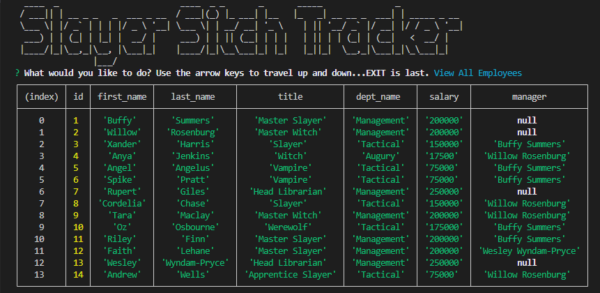

# mySQL-Employee-Tracker

## Description 

This project is a specific type of database called CMS, or content management system. 

These types of databases allow a non-developer user an easy way to interact with database information. 

Utilizing the command-line in the terminal, a user can both view and add employees, departments, and roles.

Here is an image of the results of the query "View All Employees":

-------------------------------------------------------------------------------------------------------------------------------------------------------------------------------------------

If you have found this generator outside of GitHub and wish to view the original, [visit my Repository link here.](https://github.com/tdusenbury/mySQL-Employee-Tracker)

-------------------------------------------------------------------------------------------------------------------------------------------------------------------------------------------

[Please see the video of the Slayer Sitch Employee Tracker in action here!](https://www.veed.io/view/406cec29-5601-4876-b8ae-c0cf076a6b27?panel=share)

-------------------------------------------------------------------------------------------------------------------------------------------------------------------------------------------

## Technology Used 

|  

## Table of Contents

  - [**Description**](#description)
  - [**Installation**](#installation)
  - [**Usage**](#usage)
  - [**Contribution**](#contributing)
  - [**Testing**](#tests)
  - [**Author Info**](#author-info)
  - [**License**](#license)

## Installation

The Slayer Sitch Tracker requires installation of mysql2, inquirer, console.table, dotenv, and figlet. After cloning down the repository, go to the command-line in the terminal and do an 'npm install' to install all the dependencies stated in the 'package.json' file.

## Usage 

Once the Slayer Sitch Tracker has been installed, the user will type 'node index-js' into the terminal command-line. A list of options is then presented to the user to view or add employees, roles, and departments. Each option will either auto-generate the requested information or ask a series of questions that, once answered, will be used to populate the corresponding chart which will then be displayed. To reset any additions back to the original list, enter 'mysql -u root -p' into the command-line, enter your login information, and then run the schema.sql and the seeds.sql.

ENTER PIC OF FIRST QUESTIONS

ENTER PICK OF ADD ROLE OR EMPLOYEE OR DEPT QUESTIONS

SHOW THAT THE INFORMATION IS RETAINED AND CAN BE USED IN SUBSEQUENT ADDITIONS/CHANGES

## Learning Points

I love being organized and color-coding and sorting and all the things. 

Learning how to use SQL has been a joy.

Rules, order, structure....but also a lot of thinking about how to deconstruct and then reconstruct the information to show correctly.

I look forward to learning more about SQL and its various versions to see all the many things I can do with it!

## Author Info
My name is Tamara "T" Dusenbury
If you have any questions about me or this project, please contact me:
  
- [**Github**](https://github.com/tdusenbury)

- [**LinkedIn**](https://linkedin.com/in/tamara-dusenbury-02ab8591)

- [**Email**](mailto:tamara.dusenbury@gmail.com)

## Credits

Shout outs to my whole cohort for great classes, but especially to an amazing study group!!! You know it was a curly bracket!!!!

## Contributing

If you would like to contribute, please follow the [Contributor Covenant](https://www.contributor-covenant.org/).

## License

This projects holds an MIT License.